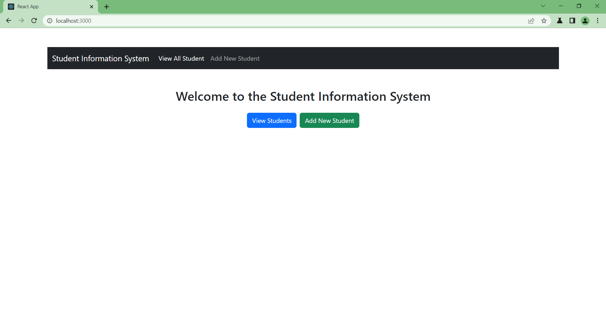
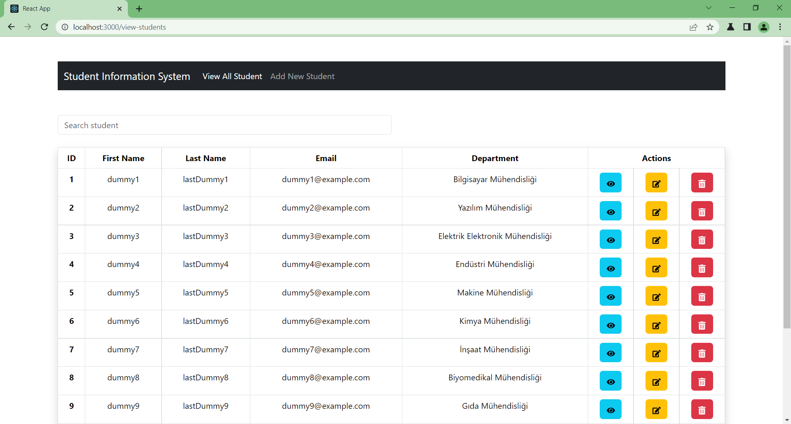
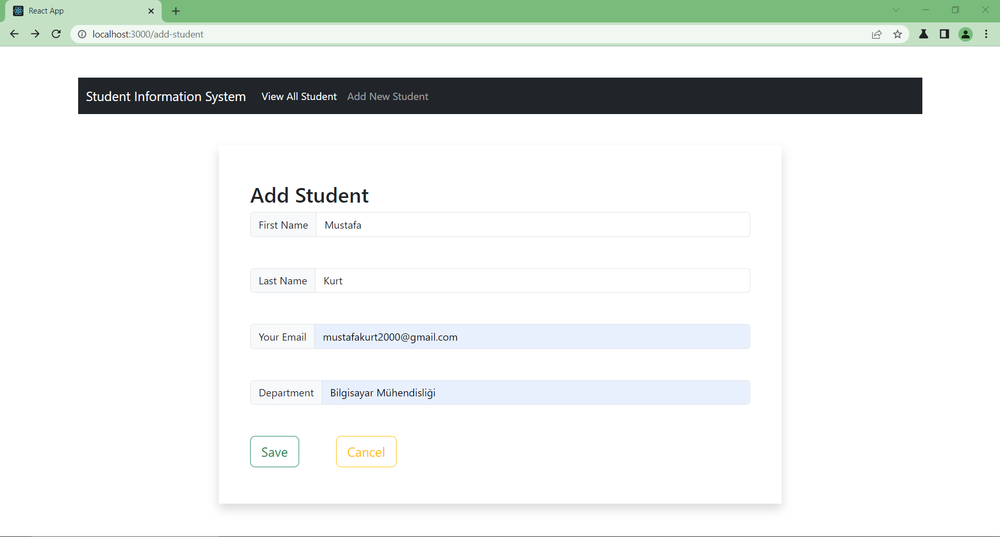
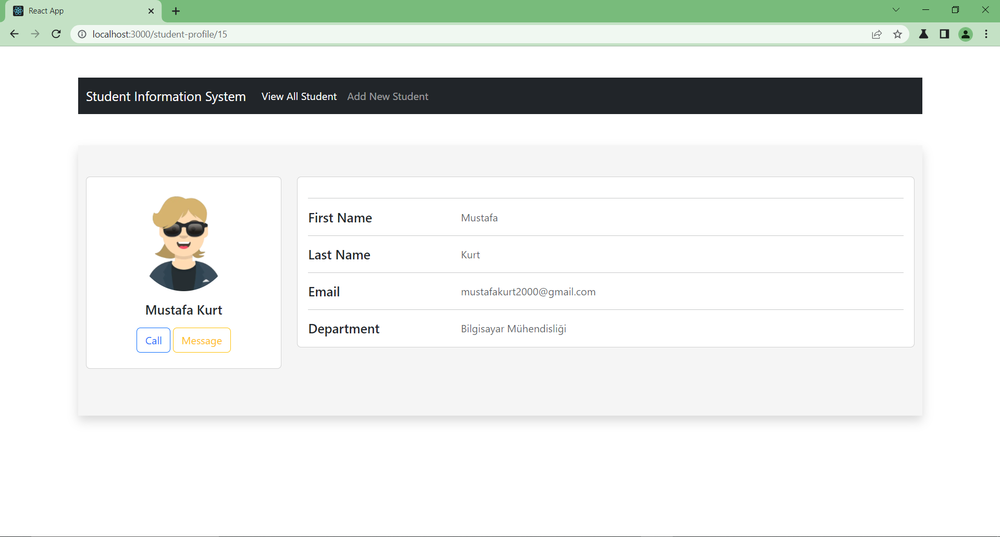

---

# Student Information System Uygulaması
Bu proje, bir öğrenci yönetim sistemi için bir web uygulamasıdır. Hem backend hem de frontend bileşenlerini içerir ve öğrenci verilerini saklamak, görüntülemek, eklemek ve düzenlemek için bir arayüz sağlar. Aşağıdaki video, projenin çalışmasını ve nasıl kullanılacağını göstermektedir:

[Student Information System](https://youtu.be/xUg4_ZO5m8s)


## 💻 Kullanılan Teknolojiler
- Spring Boot
- React.js
- MySQL

## 🚀 Ekran Görüntüleri

_Anasayfa: Yapılacak işlemin seçileceği sayfa._

_Öğrencileri Listeleme Sayfası: Kayıtlı öğrencilerin listelendiği sayfa._

_Öğrenci Ekleme Sayfası: Öğrenci ekleme sayfası._

_Öğrenci Profili Sayfası: Seçilen öğrenciye ait bilgilerin görüntülendiği sayfa._


## 🔍 Postman İstekleri
Postman ile uygulamaya erişmek için aşağıdaki istekleri kullanabilirsiniz:
- **GET**: Tüm öğrencileri listeleme  
  `http://localhost:8080/api/student`
- **POST**: Yeni öğrenci ekleme  
  `http://localhost:8080/api/student`  
  ```json
  {
      "firstName": "İsim",
      "lastName": "Soyisim",
      "email": "student@mail.com",
      "department": "Endüstri Mühendisliği"
  }
  ```
 **PUT**: Çalışan bilgilerini güncelleme  
  `http://localhost:8080/api/student/{id}`  

  ```json
  {
      "firstName": "Güncel İsim",
      "lastName": "Güncel Soyisim",
      "email": "student@mail.com",
      "department": "Endüstri Mühendisliği"
  }
  ```
- **DELETE**: Öğrenciyi silme  
  `http://localhost:8080/api/student/{id}`
- **GET**: Öğrenciyi ID'ye göre getirme  
  `http://localhost:8080/api/student/{id}`


## 📝 Kullanım
- Ana sayfada bulunan "View All Student" butonuna tıklandığında tüm çalışanlar listelenir.
- Yeni bir öğrenci eklemek için "Add New Student" butonuna tıklayın ve gerekli bilgileri girin.
- Öğrenci listesinin üstündeki arama kutucuğunu kullanarak isim ve soyisim bilgileriyle arama yapın.
- Bir öğrenciye ait bilgileri görmek için göz ikonuna tıklayın.
- Bir öğrencinin bilgilerini düzenlemek için düzenleme ikonuna tıklayın ve gerekli güncellemeyi yapın.
- Bir öğrenciyi silmek için çöp kutusu ikonuna tıklayın.

##  🗺️ Kurulum
1. **Projeyi İndirin**: GitHub üzerinden projeyi klonlayın veya ZIP olarak indirin.
2. **Veritabanı Ayarları**:
   - MySQL veritabanı oluşturun.
   - `backend/src/main/resources/application.properties` dosyasında, MySQL veritabanı bağlantı bilgilerini güncelleyin.
3. **Projeyi Çalıştırma**:
   - Terminal veya komut istemcisinde `backend` dizinine gidin ve `mvn spring-boot:run` komutunu çalıştırın.
   - Frontend kısmını çalıştırmak için terminalde `frontend` dizinine gidin ve `npm install` komutunu çalıştırın. Daha sonra `npm start` komutunu kullanarak frontend'i başlatın.
4. **Tarayıcıda Gösterim**: Tarayıcınızda [http://localhost:3000](http://localhost:3000) adresine giderek uygulamayı görüntüleyin.

## 💬 Katkıda Bulunma
1. Bu depoyu fork edin.
2. Yeni özellikler veya hata düzeltmeleri için bir dal oluşturun (`git checkout -b feature/feature-name` veya `git checkout -b bugfix/bug-name`)
3. Değişikliklerinizi doğrulayın (`git commit -am 'Add new feature'`)
4. Dallarınızı ana depoya push edin (`git push origin feature/feature-name` veya `git push origin bugfix/bug-name`)
5. Bir pull isteği (pull request) açın.


---